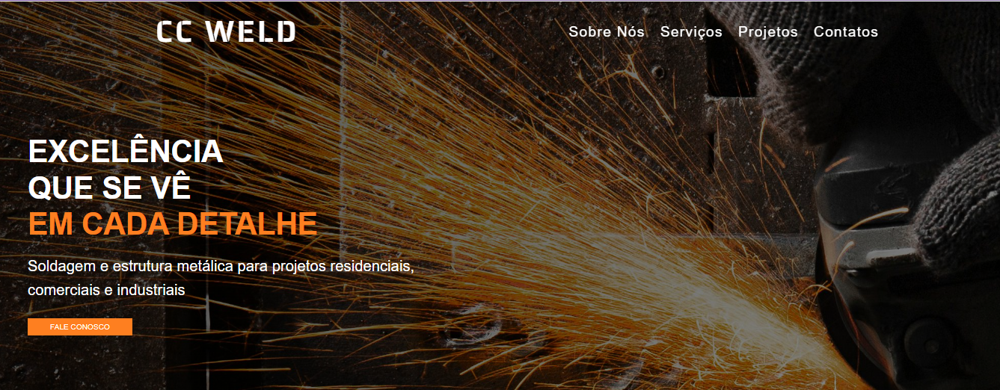

# Welding Company Landing Page   ]

Landing page responsiva desenvolvida para uma empresa fictícia do setor de soldagem e estruturas metálicas.

Este projeto foi criado com foco na prática de desenvolvimento front-end utilizando HTML5, CSS3 e JavaScript, aplicando conceitos de responsividade, organização de layout e interatividade.

## Funcionalidades

* Menu hambúrguer para dispositivos móveis
* Navegação suave entre seções
* Animações de entrada durante o scroll
* Layout responsivo para mobile, tablet e desktop
* Galeria de projetos com rolagem horizontal
* Design adaptado para empresas do setor industrial

## Tecnologias Utilizadas

* HTML5
* CSS3
* JavaScript
* Git e GitHub

## Objetivos do Projeto

* Praticar desenvolvimento responsivo (Mobile First)
* Aplicar Flexbox e CSS Grid
* Trabalhar com manipulação de classes via JavaScript
* Publicar um projeto completo utilizando GitHub Pages

## Projeto Online

Acesse o projeto:

🔗 https://taniellenrodrigues.github.io/welding-company-landing/

⸻

Desenvolvido por Taniellen Rodrigues como parte dos estudos de desenvolvimento web.
